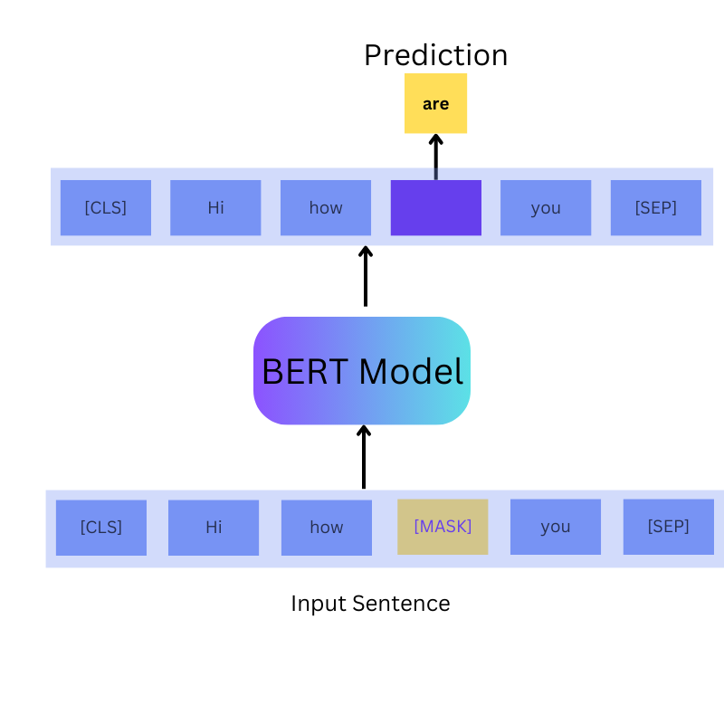

# BERT: Bidirectional Encoder Representations from Transformers

**This github contains code for [BERT: Bidirectional Encoder Representations from Transformers](https://learnopencv.com/bert-bidirectional-encoder-representations-from-transformers/) - Unlocking the Power of Deep Contextualized Word Embeddings blogpost**.

Download the Jupyter notebooks and the trained model using the following link.

